```mermaid
graph LR
    TwilioClient["TwilioClient"]
    APIDomain["APIDomain"]
    APIVersionHandler["APIVersionHandler"]
    ResourceCollectionManager["ResourceCollectionManager"]
    SingleResourceHandler["SingleResourceHandler"]
    ResourceOperationExecutor["ResourceOperationExecutor"]
    PaginationProcessor["PaginationProcessor"]
    RequestParameterFormatter["RequestParameterFormatter"]
    APIRequestSerializer["APIRequestSerializer"]
    CoreBaseClasses["CoreBaseClasses"]
    TwilioClient -- "initializes" --> APIDomain
    APIDomain -- "contains" --> APIVersionHandler
    APIVersionHandler -- "provides" --> ResourceCollectionManager
    ResourceCollectionManager -- "manages" --> SingleResourceHandler
    SingleResourceHandler -- "executes operations via" --> ResourceOperationExecutor
    ResourceCollectionManager -- "uses" --> PaginationProcessor
    ResourceOperationExecutor -- "formats data with" --> RequestParameterFormatter
    ResourceOperationExecutor -- "serializes data with" --> APIRequestSerializer
    ResourceCollectionManager -- "inherits from" --> CoreBaseClasses
    SingleResourceHandler -- "inherits from" --> CoreBaseClasses
    ResourceOperationExecutor -- "inherits from" --> CoreBaseClasses
    APIVersionHandler -- "inherits from" --> CoreBaseClasses
    APIDomain -- "inherits from" --> CoreBaseClasses
    PaginationProcessor -- "creates instances for" --> SingleResourceHandler
```

## Component Details

The "Account, Resource & Compliance Management" subsystem within the Twilio Python helper library provides a structured approach to interacting with various Twilio API domains related to account management, phone numbers, pricing, marketplace, identity and access management, OAuth, preview features, user verification, and regulatory compliance. It leverages a hierarchical component model, starting from a central client, progressing through API domains and versions, and culminating in managers for resource collections and individual resource operations. Utility components handle data formatting, serialization, and pagination, ensuring efficient and standardized communication with the Twilio API.

### TwilioClient
The main entry point for the Twilio Python helper library, responsible for initializing the client with authentication credentials and providing access to all the different Twilio API domains.

**Related Classes/Methods**:

- `twilio.rest.Client` (full file reference)

### APIDomain
Represents a top-level Twilio API domain (e.g., Accounts, Marketplace, Preview). It acts as a gateway to different versions of that API, specifically for account-related resources, phone numbers, pricing, marketplace add-ons, IAM, OAuth, preview features, user verification, and regulatory compliance.

**Related Classes/Methods**:

- <a href="https://github.com/twilio/twilio-python/blob/master/twilio/rest/accounts/AccountsBase.py#L19-L44" target="_blank" rel="noopener noreferrer">`twilio.rest.accounts.AccountsBase` (19:44)</a>
- <a href="https://github.com/twilio/twilio-python/blob/master/twilio/rest/numbers/NumbersBase.py#L20-L55" target="_blank" rel="noopener noreferrer">`twilio.rest.numbers.NumbersBase` (20:55)</a>
- <a href="https://github.com/twilio/twilio-python/blob/master/twilio/rest/pricing/PricingBase.py#L20-L55" target="_blank" rel="noopener noreferrer">`twilio.rest.pricing.PricingBase` (20:55)</a>
- <a href="https://github.com/twilio/twilio-python/blob/master/twilio/rest/marketplace/MarketplaceBase.py#L19-L44" target="_blank" rel="noopener noreferrer">`twilio.rest.marketplace.MarketplaceBase` (19:44)</a>
- <a href="https://github.com/twilio/twilio-python/blob/master/twilio/rest/iam/IamBase.py#L19-L44" target="_blank" rel="noopener noreferrer">`twilio.rest.iam.IamBase` (19:44)</a>
- <a href="https://github.com/twilio/twilio-python/blob/master/twilio/rest/oauth/OauthBase.py#L19-L44" target="_blank" rel="noopener noreferrer">`twilio.rest.oauth.OauthBase` (19:44)</a>
- <a href="https://github.com/twilio/twilio-python/blob/master/twilio/rest/preview/PreviewBase.py#L21-L66" target="_blank" rel="noopener noreferrer">`twilio.rest.preview.PreviewBase` (21:66)</a>
- <a href="https://github.com/twilio/twilio-python/blob/master/twilio/rest/verify/VerifyBase.py#L19-L44" target="_blank" rel="noopener noreferrer">`twilio.rest.verify.VerifyBase` (19:44)</a>
- <a href="https://github.com/twilio/twilio-python/blob/master/twilio/rest/trusthub/TrusthubBase.py#L19-L44" target="_blank" rel="noopener noreferrer">`twilio.rest.trusthub.TrusthubBase` (19:44)</a>

### APIVersionHandler
Manages access to specific API versions within a Twilio API domain. It provides methods to retrieve resource lists for that version, relevant to the various account, resource, and compliance management APIs.

**Related Classes/Methods**:

- `twilio.rest.accounts.v1.V1` (full file reference)
- `twilio.rest.numbers.v1.V1` (full file reference)
- `twilio.rest.numbers.v2.V2` (full file reference)
- `twilio.rest.pricing.v1.V1` (full file reference)
- `twilio.rest.pricing.v2.V2` (full file reference)
- `twilio.rest.marketplace.v1.V1` (full file reference)
- `twilio.rest.iam.v1.V1` (full file reference)
- `twilio.rest.oauth.v1.V1` (full file reference)
- `twilio.rest.preview.hosted_numbers.HostedNumbers` (full file reference)
- `twilio.rest.preview.marketplace.Marketplace` (full file reference)
- `twilio.rest.preview.wireless.Wireless` (full file reference)
- `twilio.rest.verify.v2.V2` (full file reference)
- `twilio.rest.trusthub.v1.V1` (full file reference)

### ResourceCollectionManager
Handles operations on collections of resources, such as listing, streaming, and creating new instances, for various account, number, pricing, marketplace, IAM, OAuth, verify, and trusthub resources.

**Related Classes/Methods**:

- <a href="https://github.com/twilio/twilio-python/blob/master/twilio/rest/accounts/v1/auth_token_promotion.py#L150-L181" target="_blank" rel="noopener noreferrer">`twilio.rest.accounts.v1.auth_token_promotion.AuthTokenPromotionList` (150:181)</a>
- `twilio.rest.numbers.v2.regulatory_compliance.bundle.BundleList` (full file reference)
- <a href="https://github.com/twilio/twilio-python/blob/master/twilio/rest/pricing/v2/country.py#L189-L417" target="_blank" rel="noopener noreferrer">`twilio.rest.pricing.v2.country.CountryList` (189:417)</a>
- `twilio.rest.marketplace.v1.installed_add_on.InstalledAddOnList` (full file reference)
- <a href="https://github.com/twilio/twilio-python/blob/master/twilio/rest/iam/v1/api_key.py#L309-L342" target="_blank" rel="noopener noreferrer">`twilio.rest.iam.v1.api_key.ApiKeyList` (309:342)</a>
- <a href="https://github.com/twilio/twilio-python/blob/master/twilio/rest/oauth/v1/token.py#L51-L170" target="_blank" rel="noopener noreferrer">`twilio.rest.oauth.v1.token.TokenList` (51:170)</a>
- `twilio.rest.verify.v2.service.ServiceList` (full file reference)
- `twilio.rest.trusthub.v1.customer_profiles.CustomerProfilesList` (full file reference)

### SingleResourceHandler
Represents a single instance of an API resource, providing properties to access its data and methods to perform actions like fetching, updating, or deleting that specific resource within the account, number, pricing, marketplace, IAM, OAuth, verify, and trusthub domains.

**Related Classes/Methods**:

- <a href="https://github.com/twilio/twilio-python/blob/master/twilio/rest/accounts/v1/auth_token_promotion.py#L24-L87" target="_blank" rel="noopener noreferrer">`twilio.rest.accounts.v1.auth_token_promotion.AuthTokenPromotionInstance` (24:87)</a>
- `twilio.rest.numbers.v2.regulatory_compliance.bundle.BundleInstance` (full file reference)
- <a href="https://github.com/twilio/twilio-python/blob/master/twilio/rest/pricing/v2/country.py#L24-L98" target="_blank" rel="noopener noreferrer">`twilio.rest.pricing.v2.country.CountryInstance` (24:98)</a>
- `twilio.rest.marketplace.v1.installed_add_on.InstalledAddOnInstance` (full file reference)
- <a href="https://github.com/twilio/twilio-python/blob/master/twilio/rest/iam/v1/api_key.py#L24-L147" target="_blank" rel="noopener noreferrer">`twilio.rest.iam.v1.api_key.ApiKeyInstance` (24:147)</a>
- <a href="https://github.com/twilio/twilio-python/blob/master/twilio/rest/oauth/v1/token.py#L23-L48" target="_blank" rel="noopener noreferrer">`twilio.rest.oauth.v1.token.TokenInstance` (23:48)</a>
- `twilio.rest.verify.v2.service.ServiceInstance` (full file reference)
- `twilio.rest.trusthub.v1.customer_profiles.CustomerProfilesInstance` (full file reference)

### ResourceOperationExecutor
Executes specific operations (fetch, update, delete) on a single resource instance by interacting directly with the Twilio API, encapsulating the logic for making HTTP requests for account, number, pricing, marketplace, IAM, OAuth, verify, and trusthub resources.

**Related Classes/Methods**:

- <a href="https://github.com/twilio/twilio-python/blob/master/twilio/rest/accounts/v1/auth_token_promotion.py#L90-L147" target="_blank" rel="noopener noreferrer">`twilio.rest.accounts.v1.auth_token_promotion.AuthTokenPromotionContext` (90:147)</a>
- `twilio.rest.numbers.v2.regulatory_compliance.bundle.BundleContext` (full file reference)
- <a href="https://github.com/twilio/twilio-python/blob/master/twilio/rest/pricing/v2/country.py#L101-L167" target="_blank" rel="noopener noreferrer">`twilio.rest.pricing.v2.country.CountryContext` (101:167)</a>
- `twilio.rest.marketplace.v1.installed_add_on.InstalledAddOnContext` (full file reference)
- <a href="https://github.com/twilio/twilio-python/blob/master/twilio/rest/iam/v1/api_key.py#L150-L306" target="_blank" rel="noopener noreferrer">`twilio.rest.iam.v1.api_key.ApiKeyContext` (150:306)</a>
- `twilio.rest.oauth.v1.token.TokenContext` (full file reference)
- `twilio.rest.verify.v2.service.ServiceContext` (full file reference)
- `twilio.rest.trusthub.v1.customer_profiles.CustomerProfilesContext` (full file reference)

### PaginationProcessor
Responsible for handling paginated responses from the Twilio API, extracting individual resource instances from each page and facilitating iteration over large datasets of resources.

**Related Classes/Methods**:

- <a href="https://github.com/twilio/twilio-python/blob/master/twilio/base/page.py#L8-L173" target="_blank" rel="noopener noreferrer">`twilio.base.page.Page` (8:173)</a>

### RequestParameterFormatter
A utility component that formats and processes input parameters for API requests, including handling default values and converting data types to the required API format.

**Related Classes/Methods**:

- <a href="https://github.com/twilio/twilio-python/blob/master/twilio/base/values.py#L6-L13" target="_blank" rel="noopener noreferrer">`twilio.base.values.of` (6:13)</a>

### APIRequestSerializer
Handles the serialization of Python data structures into the appropriate format for Twilio API requests, such as converting booleans, objects, maps, and datetime objects into their string representations.

**Related Classes/Methods**:

- <a href="https://github.com/twilio/twilio-python/blob/master/twilio/base/serialize.py#L64-L74" target="_blank" rel="noopener noreferrer">`twilio.base.serialize.boolean_to_string` (64:74)</a>
- <a href="https://github.com/twilio/twilio-python/blob/master/twilio/base/serialize.py#L77-L84" target="_blank" rel="noopener noreferrer">`twilio.base.serialize.object` (77:84)</a>
- <a href="https://github.com/twilio/twilio-python/blob/master/twilio/base/serialize.py#L87-L93" target="_blank" rel="noopener noreferrer">`twilio.base.serialize.map` (87:93)</a>
- <a href="https://github.com/twilio/twilio-python/blob/master/twilio/base/serialize.py#L22-L32" target="_blank" rel="noopener noreferrer">`twilio.base.serialize.iso8601_datetime` (22:32)</a>

### CoreBaseClasses
Provides foundational abstract classes that define the common architectural patterns for the Twilio API client, including how resources are listed, represented as instances, and how their operations are contextualized across all API domains.

**Related Classes/Methods**:

- <a href="https://github.com/twilio/twilio-python/blob/master/twilio/base/list_resource.py#L4-L6" target="_blank" rel="noopener noreferrer">`twilio.base.list_resource.ListResource` (4:6)</a>
- <a href="https://github.com/twilio/twilio-python/blob/master/twilio/base/instance_resource.py#L4-L6" target="_blank" rel="noopener noreferrer">`twilio.base.instance_resource.InstanceResource` (4:6)</a>
- <a href="https://github.com/twilio/twilio-python/blob/master/twilio/base/instance_context.py#L4-L6" target="_blank" rel="noopener noreferrer">`twilio.base.instance_context.InstanceContext` (4:6)</a>
- <a href="https://github.com/twilio/twilio-python/blob/master/twilio/base/version.py#L11-L489" target="_blank" rel="noopener noreferrer">`twilio.base.version.Version` (11:489)</a>
- <a href="https://github.com/twilio/twilio-python/blob/master/twilio/base/domain.py#L6-L93" target="_blank" rel="noopener noreferrer">`twilio.base.domain.Domain` (6:93)</a>

### [FAQ](https://github.com/CodeBoarding/GeneratedOnBoardings/tree/main?tab=readme-ov-file#faq)