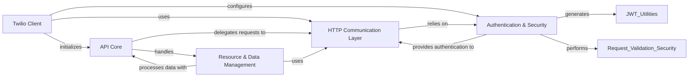

## Component Details

This component overview details the core client and infrastructure of the Twilio Python library, which serves as the central mechanism for interacting with the Twilio API. It encompasses the client's initialization, the foundational API structure including versioning and domain management, the underlying HTTP communication, robust authentication and security measures, and abstractions for managing API resources and data. The primary flow involves the Twilio Client initiating requests, which are then processed by the API Core and HTTP Communication Layer, with authentication and data handling managed by their respective components. Its purpose is to provide a comprehensive, secure, and easy-to-use interface for developers to interact with Twilio services.

### Twilio Client
The central entry point for all Twilio API interactions, responsible for client initialization and providing access to various Twilio API resources.

**Related Classes/Methods**:

- `twilio.rest.Client` (full file reference)
- <a href="https://github.com/twilio/twilio-python/blob/master/twilio/base/client_base.py#L13-L271" target="_blank" rel="noopener noreferrer">`twilio.base.client_base.ClientBase` (13:271)</a>

### API Core
Provides foundational elements for API interaction, including versioning, domain management, and a base for Twilio-specific exceptions. It defines the structure for how different API versions and domains are accessed.

**Related Classes/Methods**:

- <a href="https://github.com/twilio/twilio-python/blob/master/twilio/base/version.py#L11-L489" target="_blank" rel="noopener noreferrer">`twilio.base.version.Version` (11:489)</a>
- <a href="https://github.com/twilio/twilio-python/blob/master/twilio/base/domain.py#L6-L93" target="_blank" rel="noopener noreferrer">`twilio.base.domain.Domain` (6:93)</a>
- <a href="https://github.com/twilio/twilio-python/blob/master/twilio/base/exceptions.py#L10-L82" target="_blank" rel="noopener noreferrer">`twilio.base.exceptions.TwilioRestException` (10:82)</a>

### HTTP Communication Layer
Manages synchronous and asynchronous low-level HTTP requests and responses with the Twilio API. This includes preparing requests, handling network communication, and processing raw HTTP responses.

**Related Classes/Methods**:

- <a href="https://github.com/twilio/twilio-python/blob/master/twilio/http/http_client.py#L15-L119" target="_blank" rel="noopener noreferrer">`twilio.http.http_client.TwilioHttpClient` (15:119)</a>
- `twilio.http.HttpClient` (full file reference)
- `twilio.http.AsyncHttpClient` (full file reference)
- <a href="https://github.com/twilio/twilio-python/blob/master/twilio/http/async_http_client.py#L14-L135" target="_blank" rel="noopener noreferrer">`twilio.http.async_http_client.AsyncTwilioHttpClient` (14:135)</a>
- <a href="https://github.com/twilio/twilio-python/blob/master/twilio/http/request.py#L10-L91" target="_blank" rel="noopener noreferrer">`twilio.http.request.Request` (10:91)</a>
- <a href="https://github.com/twilio/twilio-python/blob/master/twilio/http/response.py#L4-L22" target="_blank" rel="noopener noreferrer">`twilio.http.response.Response` (4:22)</a>

### Authentication & Security
Encompasses all aspects of secure communication, including various authentication strategies, credential provision, token management (generation and refresh), and validation of incoming requests and client-side JWTs.

**Related Classes/Methods**:

- <a href="https://github.com/twilio/twilio-python/blob/master/twilio/auth_strategy/auth_strategy.py#L5-L19" target="_blank" rel="noopener noreferrer">`twilio.auth_strategy.auth_strategy.AuthStrategy` (5:19)</a>
- <a href="https://github.com/twilio/twilio-python/blob/master/twilio/auth_strategy/no_auth_strategy.py#L5-L13" target="_blank" rel="noopener noreferrer">`twilio.auth_strategy.no_auth_strategy.NoAuthStrategy` (5:13)</a>
- <a href="https://github.com/twilio/twilio-python/blob/master/twilio/auth_strategy/token_auth_strategy.py#L11-L55" target="_blank" rel="noopener noreferrer">`twilio.auth_strategy.token_auth_strategy.TokenAuthStrategy` (11:55)</a>
- <a href="https://github.com/twilio/twilio-python/blob/master/twilio/credential/credential_provider.py#L4-L13" target="_blank" rel="noopener noreferrer">`twilio.credential.credential_provider.CredentialProvider` (4:13)</a>
- <a href="https://github.com/twilio/twilio-python/blob/master/twilio/credential/client_credential_provider.py#L8-L28" target="_blank" rel="noopener noreferrer">`twilio.credential.client_credential_provider.ClientCredentialProvider` (8:28)</a>
- <a href="https://github.com/twilio/twilio-python/blob/master/twilio/credential/orgs_credential_provider.py#L8-L28" target="_blank" rel="noopener noreferrer">`twilio.credential.orgs_credential_provider.OrgsCredentialProvider` (8:28)</a>
- <a href="https://github.com/twilio/twilio-python/blob/master/twilio/http/client_token_manager.py#L5-L41" target="_blank" rel="noopener noreferrer">`twilio.http.client_token_manager.ClientTokenManager` (5:41)</a>
- <a href="https://github.com/twilio/twilio-python/blob/master/twilio/http/orgs_token_manager.py#L5-L41" target="_blank" rel="noopener noreferrer">`twilio.http.orgs_token_manager.OrgTokenManager` (5:41)</a>
- <a href="https://github.com/twilio/twilio-python/blob/master/twilio/http/token_manager.py#L4-L7" target="_blank" rel="noopener noreferrer">`twilio.http.token_manager.TokenManager` (4:7)</a>
- `twilio.jwt.Jwt` (full file reference)
- `twilio.jwt.access_token.AccessTokenGrant` (full file reference)
- `twilio.jwt.access_token.AccessToken` (full file reference)
- <a href="https://github.com/twilio/twilio-python/blob/master/twilio/jwt/taskrouter/capabilities.py#L4-L68" target="_blank" rel="noopener noreferrer">`twilio.jwt.taskrouter.capabilities.WorkerCapabilityToken` (4:68)</a>
- <a href="https://github.com/twilio/twilio-python/blob/master/twilio/jwt/taskrouter/capabilities.py#L71-L93" target="_blank" rel="noopener noreferrer">`twilio.jwt.taskrouter.capabilities.TaskQueueCapabilityToken` (71:93)</a>
- <a href="https://github.com/twilio/twilio-python/blob/master/twilio/jwt/taskrouter/capabilities.py#L96-L116" target="_blank" rel="noopener noreferrer">`twilio.jwt.taskrouter.capabilities.WorkspaceCapabilityToken` (96:116)</a>
- `twilio.jwt.taskrouter.TaskRouterCapabilityToken` (full file reference)
- `twilio.jwt.client.ClientCapabilityToken` (full file reference)
- `twilio.jwt.client.ScopeURI` (full file reference)
- `twilio.jwt.validation.ClientValidationJwt` (full file reference)
- <a href="https://github.com/twilio/twilio-python/blob/master/twilio/request_validator.py#L61-L137" target="_blank" rel="noopener noreferrer">`twilio.request_validator.RequestValidator` (61:137)</a>
- <a href="https://github.com/twilio/twilio-python/blob/master/twilio/http/validation_client.py#L18-L138" target="_blank" rel="noopener noreferrer">`twilio.http.validation_client.ValidationClient` (18:138)</a>

### Resource & Data Management
Provides the abstract and concrete classes for representing and interacting with Twilio API resources, handling pagination, and utility functions for data serialization, deserialization, and value manipulation.

**Related Classes/Methods**:

- <a href="https://github.com/twilio/twilio-python/blob/master/twilio/base/list_resource.py#L4-L6" target="_blank" rel="noopener noreferrer">`twilio.base.list_resource.ListResource` (4:6)</a>
- <a href="https://github.com/twilio/twilio-python/blob/master/twilio/base/instance_resource.py#L4-L6" target="_blank" rel="noopener noreferrer">`twilio.base.instance_resource.InstanceResource` (4:6)</a>
- <a href="https://github.com/twilio/twilio-python/blob/master/twilio/base/instance_context.py#L4-L6" target="_blank" rel="noopener noreferrer">`twilio.base.instance_context.InstanceContext` (4:6)</a>
- <a href="https://github.com/twilio/twilio-python/blob/master/twilio/base/page.py#L8-L173" target="_blank" rel="noopener noreferrer">`twilio.base.page.Page` (8:173)</a>
- <a href="https://github.com/twilio/twilio-python/blob/master/twilio/base/values.py#L6-L13" target="_blank" rel="noopener noreferrer">`twilio.base.values.of` (6:13)</a>
- `twilio.base.serialize` (full file reference)
- `twilio.base.deserialize` (full file reference)
- `twilio.base.obsolete` (full file reference)

### [FAQ](https://github.com/CodeBoarding/GeneratedOnBoardings/tree/main?tab=readme-ov-file#faq)