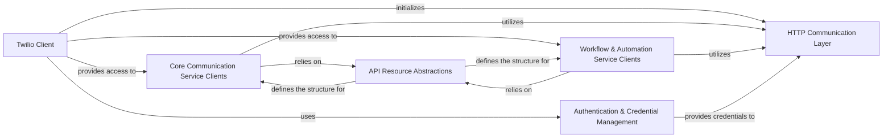

## Component Details

The Core Communication & Workflow Services subsystem provides a comprehensive set of clients for interacting with Twilio's core communication functionalities (messaging, voice, video, chat, conversations, notifications) and advanced workflow management tools (task routing, serverless, Studio, AI assistants, proxy, Flex, Frontline). These clients act as specialized interfaces, built upon foundational API resource abstractions, to enable programmatic control over Twilio's diverse communication and automation capabilities.

### Core Communication Service Clients
This component provides specialized client interfaces for managing fundamental Twilio communication services, including messaging, voice, video, chat, conversations, and notifications. Each client offers methods to interact with its respective API domain.

**Related Classes/Methods**:

- <a href="https://github.com/twilio/twilio-python/blob/master/twilio/rest/api/ApiBase.py#L19-L44" target="_blank" rel="noopener noreferrer">`twilio.rest.api.ApiBase` (19:44)</a>
- <a href="https://github.com/twilio/twilio-python/blob/master/twilio/rest/messaging/MessagingBase.py#L20-L55" target="_blank" rel="noopener noreferrer">`twilio.rest.messaging.MessagingBase` (20:55)</a>
- <a href="https://github.com/twilio/twilio-python/blob/master/twilio/rest/voice/VoiceBase.py#L19-L44" target="_blank" rel="noopener noreferrer">`twilio.rest.voice.VoiceBase` (19:44)</a>
- <a href="https://github.com/twilio/twilio-python/blob/master/twilio/rest/video/VideoBase.py#L19-L44" target="_blank" rel="noopener noreferrer">`twilio.rest.video.VideoBase` (19:44)</a>
- <a href="https://github.com/twilio/twilio-python/blob/master/twilio/rest/chat/ChatBase.py#L21-L66" target="_blank" rel="noopener noreferrer">`twilio.rest.chat.ChatBase` (21:66)</a>
- <a href="https://github.com/twilio/twilio-python/blob/master/twilio/rest/conversations/ConversationsBase.py#L19-L44" target="_blank" rel="noopener noreferrer">`twilio.rest.conversations.ConversationsBase` (19:44)</a>
- <a href="https://github.com/twilio/twilio-python/blob/master/twilio/rest/notify/NotifyBase.py#L19-L44" target="_blank" rel="noopener noreferrer">`twilio.rest.notify.NotifyBase` (19:44)</a>

### Workflow & Automation Service Clients
This component provides client interfaces for managing complex communication workflows and automation features, including task routing, serverless functions, visual workflow building (Studio), AI assistants, proxy services, Flex contact center functionalities, and Frontline user management.

**Related Classes/Methods**:

- <a href="https://github.com/twilio/twilio-python/blob/master/twilio/rest/taskrouter/TaskrouterBase.py#L19-L44" target="_blank" rel="noopener noreferrer">`twilio.rest.taskrouter.TaskrouterBase` (19:44)</a>
- <a href="https://github.com/twilio/twilio-python/blob/master/twilio/rest/serverless/ServerlessBase.py#L19-L44" target="_blank" rel="noopener noreferrer">`twilio.rest.serverless.ServerlessBase` (19:44)</a>
- <a href="https://github.com/twilio/twilio-python/blob/master/twilio/rest/studio/StudioBase.py#L20-L55" target="_blank" rel="noopener noreferrer">`twilio.rest.studio.StudioBase` (20:55)</a>
- <a href="https://github.com/twilio/twilio-python/blob/master/twilio/rest/assistants/AssistantsBase.py#L19-L44" target="_blank" rel="noopener noreferrer">`twilio.rest.assistants.AssistantsBase` (19:44)</a>
- <a href="https://github.com/twilio/twilio-python/blob/master/twilio/rest/proxy/ProxyBase.py#L19-L44" target="_blank" rel="noopener noreferrer">`twilio.rest.proxy.ProxyBase` (19:44)</a>
- <a href="https://github.com/twilio/twilio-python/blob/master/twilio/rest/flex_api/FlexApiBase.py#L20-L55" target="_blank" rel="noopener noreferrer">`twilio.rest.flex_api.FlexApiBase` (20:55)</a>
- <a href="https://github.com/twilio/twilio-python/blob/master/twilio/rest/frontline_api/FrontlineApiBase.py#L19-L44" target="_blank" rel="noopener noreferrer">`twilio.rest.frontline_api.FrontlineApiBase` (19:44)</a>

### Twilio Client
The primary interface for interacting with the entire Twilio API. It acts as the entry point for most Twilio operations, initializing the HTTP client and providing access to various Twilio API domains.

**Related Classes/Methods**:

- `twilio.rest.Client` (full file reference)
- <a href="https://github.com/twilio/twilio-python/blob/master/twilio/base/client_base.py#L13-L271" target="_blank" rel="noopener noreferrer">`twilio.base.client_base.ClientBase` (13:271)</a>

### HTTP Communication Layer
Handles the low-level details of making HTTP requests to the Twilio API and processing responses. It is responsible for network communication, sending requests, and parsing the incoming data.

**Related Classes/Methods**:

- `twilio.http.http_client.HttpClient` (full file reference)
- `twilio.http.async_http_client.AsyncHttpClient` (full file reference)
- <a href="https://github.com/twilio/twilio-python/blob/master/twilio/http/request.py#L10-L91" target="_blank" rel="noopener noreferrer">`twilio.http.request.Request` (10:91)</a>
- <a href="https://github.com/twilio/twilio-python/blob/master/twilio/http/response.py#L4-L22" target="_blank" rel="noopener noreferrer">`twilio.http.response.Response` (4:22)</a>

### API Resource Abstractions
Provides foundational classes and patterns for defining and interacting with all Twilio API resources. This includes abstracting common behaviors for API domains, versions, lists of resources, individual resource instances, and their interaction contexts.

**Related Classes/Methods**:

- <a href="https://github.com/twilio/twilio-python/blob/master/twilio/base/domain.py#L6-L93" target="_blank" rel="noopener noreferrer">`twilio.base.domain.Domain` (6:93)</a>
- <a href="https://github.com/twilio/twilio-python/blob/master/twilio/base/version.py#L11-L489" target="_blank" rel="noopener noreferrer">`twilio.base.version.Version` (11:489)</a>
- <a href="https://github.com/twilio/twilio-python/blob/master/twilio/base/list_resource.py#L4-L6" target="_blank" rel="noopener noreferrer">`twilio.base.list_resource.ListResource` (4:6)</a>
- <a href="https://github.com/twilio/twilio-python/blob/master/twilio/base/instance_resource.py#L4-L6" target="_blank" rel="noopener noreferrer">`twilio.base.instance_resource.InstanceResource` (4:6)</a>
- <a href="https://github.com/twilio/twilio-python/blob/master/twilio/base/instance_context.py#L4-L6" target="_blank" rel="noopener noreferrer">`twilio.base.instance_context.InstanceContext` (4:6)</a>

### Authentication & Credential Management
Manages API authentication, including the provision of credentials and the handling of access tokens for secure interactions with the Twilio API.

**Related Classes/Methods**:

- <a href="https://github.com/twilio/twilio-python/blob/master/twilio/auth_strategy/auth_strategy.py#L5-L19" target="_blank" rel="noopener noreferrer">`twilio.auth_strategy.auth_strategy.AuthStrategy` (5:19)</a>
- <a href="https://github.com/twilio/twilio-python/blob/master/twilio/auth_strategy/token_auth_strategy.py#L11-L55" target="_blank" rel="noopener noreferrer">`twilio.auth_strategy.token_auth_strategy.TokenAuthStrategy` (11:55)</a>
- <a href="https://github.com/twilio/twilio-python/blob/master/twilio/credential/credential_provider.py#L4-L13" target="_blank" rel="noopener noreferrer">`twilio.credential.credential_provider.CredentialProvider` (4:13)</a>
- <a href="https://github.com/twilio/twilio-python/blob/master/twilio/http/token_manager.py#L4-L7" target="_blank" rel="noopener noreferrer">`twilio.http.token_manager.TokenManager` (4:7)</a>
- <a href="https://github.com/twilio/twilio-python/blob/master/twilio/http/client_token_manager.py#L5-L41" target="_blank" rel="noopener noreferrer">`twilio.http.client_token_manager.ClientTokenManager` (5:41)</a>
- <a href="https://github.com/twilio/twilio-python/blob/master/twilio/http/orgs_token_manager.py#L5-L41" target="_blank" rel="noopener noreferrer">`twilio.http.orgs_token_manager.OrgTokenManager` (5:41)</a>

### [FAQ](https://github.com/CodeBoarding/GeneratedOnBoardings/tree/main?tab=readme-ov-file#faq)