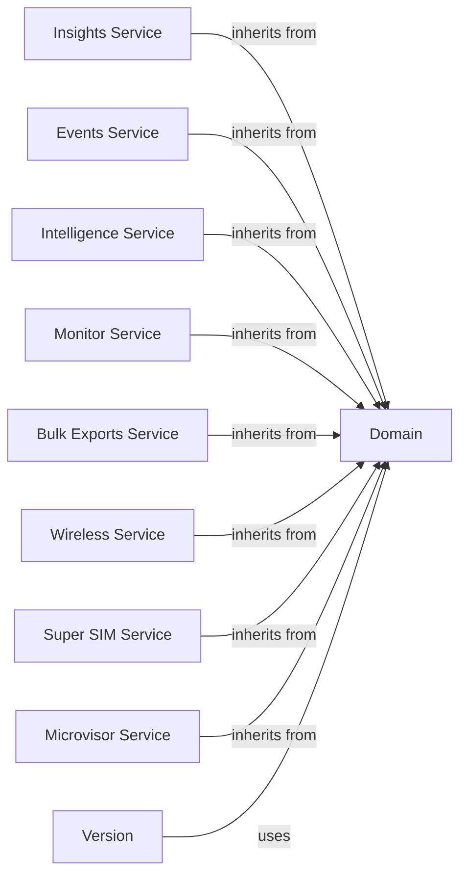

## Component Details

This subsystem provides a comprehensive interface for interacting with Twilio's data, insights, and IoT-related services. It leverages a hierarchical structure built upon foundational `Domain` and `Version` components to offer access to various specialized APIs, including those for call analytics (Insights), event streaming (Events), intelligence services (Intelligence), account monitoring (Monitor), bulk data exports (Bulk Exports), and a suite of IoT connectivity solutions (Wireless, Super SIM, Microvisor). The system facilitates the management of diverse data points, real-time events, and embedded device operations through a consistent API client structure.

### Domain
A foundational class representing a Twilio API subdomain (e.g., api.twilio.com). It provides methods for constructing absolute URLs from relative URIs and making HTTP requests (both synchronous and asynchronous) to the Twilio API. It acts as the entry point for interacting with a specific Twilio service.

**Related Classes/Methods**:

- <a href="https://github.com/twilio/twilio-python/blob/master/twilio/base/domain.py#L6-L93" target="_blank" rel="noopener noreferrer">`twilio.base.domain.Domain` (6:93)</a>

### Version
This class represents a specific version of a Twilio API (e.g., v1, v2). It extends the Domain functionality by handling version-specific URI construction and providing methods for fetching, updating, deleting, and creating resources, including pagination and streaming capabilities. It also handles error parsing for API responses.

**Related Classes/Methods**:

- <a href="https://github.com/twilio/twilio-python/blob/master/twilio/base/version.py#L11-L489" target="_blank" rel="noopener noreferrer">`twilio.base.version.Version` (11:489)</a>

### Insights Service
The entry point for accessing Twilio's Insights API, which provides data and analytics related to call quality and usage. It provides access to Insights API Version 1 resources like call annotations, call summaries, conference details, room details, and settings.

**Related Classes/Methods**:

- <a href="https://github.com/twilio/twilio-python/blob/master/twilio/rest/insights/InsightsBase.py#L19-L44" target="_blank" rel="noopener noreferrer">`twilio.rest.insights.InsightsBase` (19:44)</a>
- `twilio.rest.insights.v1.V1` (full file reference)

### Events Service
The entry point for accessing Twilio's Events API, enabling interaction with event streams, event types, schemas, sinks, and subscriptions. It provides access to Events API Version 1 resources for managing event types, schemas, sinks, and subscriptions.

**Related Classes/Methods**:

- <a href="https://github.com/twilio/twilio-python/blob/master/twilio/rest/events/EventsBase.py#L19-L44" target="_blank" rel="noopener noreferrer">`twilio.rest.events.EventsBase` (19:44)</a>
- `twilio.rest.events.v1.V1` (full file reference)

### Intelligence Service
The entry point for accessing Twilio's Intelligence API, which offers services related to call intelligence and transcription. It provides access to Intelligence API Version 2 resources for managing custom operators, prebuilt operators, services, and transcripts.

**Related Classes/Methods**:

- <a href="https://github.com/twilio/twilio-python/blob/master/twilio/rest/intelligence/IntelligenceBase.py#L19-L44" target="_blank" rel="noopener noreferrer">`twilio.rest.intelligence.IntelligenceBase` (19:44)</a>
- `twilio.rest.intelligence.v2.V2` (full file reference)

### Monitor Service
The entry point for accessing Twilio's Monitor API, used for retrieving alerts and events related to Twilio account activity. It provides access to Monitor API Version 1 resources for managing alerts and events.

**Related Classes/Methods**:

- <a href="https://github.com/twilio/twilio-python/blob/master/twilio/rest/monitor/MonitorBase.py#L19-L44" target="_blank" rel="noopener noreferrer">`twilio.rest.monitor.MonitorBase` (19:44)</a>
- `twilio.rest.monitor.v1.V1` (full file reference)

### Bulk Exports Service
The entry point for accessing Twilio's Bulk Exports API, which allows for the export of large datasets. It provides access to Bulk Exports API Version 1 resources for managing exports and export configurations.

**Related Classes/Methods**:

- <a href="https://github.com/twilio/twilio-python/blob/master/twilio/rest/bulkexports/BulkexportsBase.py#L19-L44" target="_blank" rel="noopener noreferrer">`twilio.rest.bulkexports.BulkexportsBase` (19:44)</a>
- `twilio.rest.bulkexports.v1.V1` (full file reference)

### Wireless Service
The entry point for accessing Twilio's Wireless API, used for managing wireless devices and their connectivity. It provides access to Wireless API Version 1 resources for managing commands, rate plans, SIMs, and usage records for wireless devices.

**Related Classes/Methods**:

- <a href="https://github.com/twilio/twilio-python/blob/master/twilio/rest/wireless/WirelessBase.py#L19-L44" target="_blank" rel="noopener noreferrer">`twilio.rest.wireless.WirelessBase` (19:44)</a>
- `twilio.rest.wireless.v1.V1` (full file reference)

### Super SIM Service
The entry point for accessing Twilio's Super SIM API, which provides comprehensive control over Super SIMs and their network access. It provides access to Super SIM API Version 1 resources for managing eSIM profiles, fleets, IP commands, networks, network access profiles, settings updates, SIMs, SMS commands, and usage records.

**Related Classes/Methods**:

- <a href="https://github.com/twilio/twilio-python/blob/master/twilio/rest/supersim/SupersimBase.py#L19-L44" target="_blank" rel="noopener noreferrer">`twilio.rest.supersim.SupersimBase` (19:44)</a>
- `twilio.rest.supersim.v1.V1` (full file reference)

### Microvisor Service
The entry point for accessing Twilio's Microvisor API, designed for managing embedded systems and their configurations, secrets, and applications. It provides access to Microvisor API Version 1 resources for managing account configurations, account secrets, applications, and devices.

**Related Classes/Methods**:

- <a href="https://github.com/twilio/twilio-python/blob/master/twilio/rest/microvisor/MicrovisorBase.py#L19-L44" target="_blank" rel="noopener noreferrer">`twilio.rest.microvisor.MicrovisorBase` (19:44)</a>
- `twilio.rest.microvisor.v1.V1` (full file reference)

### [FAQ](https://github.com/CodeBoarding/GeneratedOnBoardings/tree/main?tab=readme-ov-file#faq)