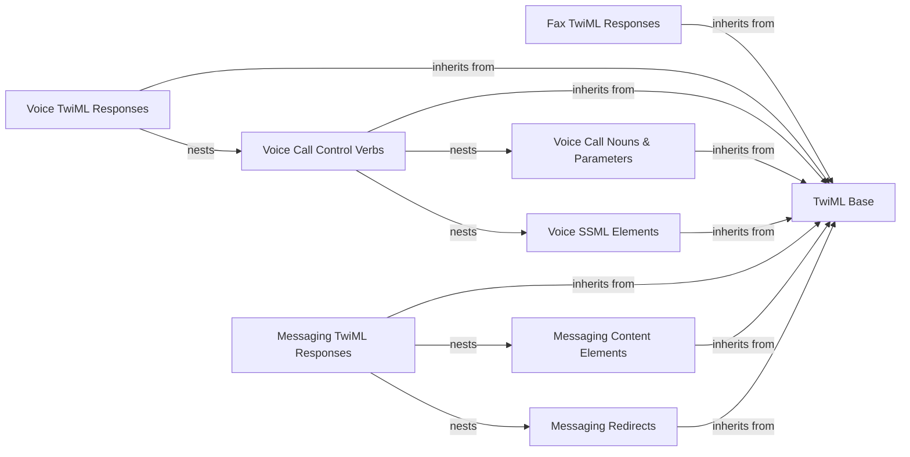

## Component Details

The TwiML Generation subsystem provides a robust framework for constructing Twilio Markup Language (TwiML) responses, which dictate the behavior of Twilio's voice, SMS, and fax interactions. It is built upon a foundational TwiML Base component that handles core XML generation and element nesting. Specialized components for Fax, Voice, and Messaging TwiML responses inherit from this base, offering specific verbs, nouns, and SSML elements tailored to each communication type. The system allows for programmatic creation of complex call flows, message content, and redirects by nesting various TwiML elements within their respective response objects.

### TwiML Base
The foundational component providing core TwiML functionalities like initialization, XML generation, and the ability to nest child elements. All specific TwiML response classes and elements inherit from this base.

**Related Classes/Methods**:

- `twilio.twiml.TwiML` (full file reference)
- `twilio.twiml.GenericNode` (full file reference)
- `twilio.twiml.TwiMLException` (full file reference)
- `twilio.twiml.lower_camel` (full file reference)

### Fax TwiML Responses
This component is responsible for initiating and structuring TwiML responses specifically for fax interactions, allowing for the inclusion of fax-specific TwiML verbs.

**Related Classes/Methods**:

- <a href="https://github.com/twilio/twilio-python/blob/master/twilio/twiml/fax_response.py#L14-L51" target="_blank" rel="noopener noreferrer">`twilio.twiml.fax_response.FaxResponse` (14:51)</a>
- <a href="https://github.com/twilio/twilio-python/blob/master/twilio/twiml/fax_response.py#L54-L59" target="_blank" rel="noopener noreferrer">`twilio.twiml.fax_response.Receive` (54:59)</a>

### Voice TwiML Responses
This component serves as the primary entry point for building TwiML responses for voice calls, enabling the nesting of various voice-related TwiML verbs and nouns.

**Related Classes/Methods**:

- <a href="https://github.com/twilio/twilio-python/blob/master/twilio/twiml/voice_response.py#L14-L564" target="_blank" rel="noopener noreferrer">`twilio.twiml.voice_response.VoiceResponse` (14:564)</a>

### Voice Call Control Verbs
These TwiML verbs define the actions and flow within a voice call, such as playing audio, gathering input, connecting to other parties, or redirecting the call. They can contain other TwiML nouns or SSML elements.

**Related Classes/Methods**:

- `twilio.twiml.voice_response.Connect` (full file reference)
- `twilio.twiml.voice_response.Dial` (full file reference)
- `twilio.twiml.voice_response.Echo` (full file reference)
- `twilio.twiml.voice_response.Enqueue` (full file reference)
- `twilio.twiml.voice_response.Gather` (full file reference)
- `twilio.twiml.voice_response.Hangup` (full file reference)
- `twilio.twiml.voice_response.Leave` (full file reference)
- <a href="https://github.com/twilio/twilio-python/blob/master/twilio/twiml/voice_response.py#L999-L1000" target="_blank" rel="noopener noreferrer">`twilio.twiml.voice_response.Pause` (999:1000)</a>
- `twilio.twiml.voice_response.Play` (full file reference)
- `twilio.twiml.voice_response.Queue` (full file reference)
- `twilio.twiml.voice_response.Record` (full file reference)
- `twilio.twiml.voice_response.Redirect` (full file reference)
- `twilio.twiml.voice_response.Reject` (full file reference)
- `twilio.twiml.voice_response.Say` (full file reference)
- `twilio.twiml.voice_response.Sms` (full file reference)
- `twilio.twiml.voice_response.Pay` (full file reference)
- <a href="https://github.com/twilio/twilio-python/blob/master/twilio/twiml/voice_response.py#L951-L996" target="_blank" rel="noopener noreferrer">`twilio.twiml.voice_response.Prompt` (951:996)</a>
- <a href="https://github.com/twilio/twilio-python/blob/master/twilio/twiml/voice_response.py#L817-L948" target="_blank" rel="noopener noreferrer">`twilio.twiml.voice_response.Start` (817:948)</a>
- <a href="https://github.com/twilio/twilio-python/blob/master/twilio/twiml/voice_response.py#L595-L726" target="_blank" rel="noopener noreferrer">`twilio.twiml.voice_response.Stop` (595:726)</a>
- <a href="https://github.com/twilio/twilio-python/blob/master/twilio/twiml/voice_response.py#L567-L583" target="_blank" rel="noopener noreferrer">`twilio.twiml.voice_response.Refer` (567:583)</a>

### Voice Call Nouns & Parameters
This component represents TwiML nouns and parameters that provide specific details, configurations, or entities used within voice call control verbs, such as client identities, conference names, or custom parameters.

**Related Classes/Methods**:

- <a href="https://github.com/twilio/twilio-python/blob/master/twilio/twiml/voice_response.py#L586-L592" target="_blank" rel="noopener noreferrer">`twilio.twiml.voice_response.ReferSip` (586:592)</a>
- <a href="https://github.com/twilio/twilio-python/blob/master/twilio/twiml/voice_response.py#L797-L814" target="_blank" rel="noopener noreferrer">`twilio.twiml.voice_response.Stream` (797:814)</a>
- <a href="https://github.com/twilio/twilio-python/blob/master/twilio/twiml/voice_response.py#L777-L794" target="_blank" rel="noopener noreferrer">`twilio.twiml.voice_response.Siprec` (777:794)</a>
- <a href="https://github.com/twilio/twilio-python/blob/master/twilio/twiml/voice_response.py#L729-L758" target="_blank" rel="noopener noreferrer">`twilio.twiml.voice_response.Transcription` (729:758)</a>
- <a href="https://github.com/twilio/twilio-python/blob/master/twilio/twiml/voice_response.py#L761-L766" target="_blank" rel="noopener noreferrer">`twilio.twiml.voice_response.Parameter` (761:766)</a>
- <a href="https://github.com/twilio/twilio-python/blob/master/twilio/twiml/voice_response.py#L769-L774" target="_blank" rel="noopener noreferrer">`twilio.twiml.voice_response.Config` (769:774)</a>
- `twilio.twiml.voice_response.Task` (full file reference)
- `twilio.twiml.voice_response.Client` (full file reference)
- `twilio.twiml.voice_response.Conference` (full file reference)
- `twilio.twiml.voice_response.Number` (full file reference)
- `twilio.twiml.voice_response.Sim` (full file reference)
- `twilio.twiml.voice_response.Sip` (full file reference)
- `twilio.twiml.voice_response.Application` (full file reference)
- `twilio.twiml.voice_response.ApplicationSid` (full file reference)
- `twilio.twiml.voice_response.Identity` (full file reference)
- `twilio.twiml.voice_response.Room` (full file reference)
- `twilio.twiml.voice_response.Autopilot` (full file reference)
- `twilio.twiml.voice_response.VirtualAgent` (full file reference)
- `twilio.twiml.voice_response.Conversation` (full file reference)
- `twilio.twiml.voice_response.ConversationRelay` (full file reference)
- `twilio.twiml.voice_response.Assistant` (full file reference)
- `twilio.twiml.voice_response.Language` (full file reference)

### Voice SSML Elements
This component comprises specialized Speech Synthesis Markup Language (SSML) elements that offer granular control over how text is spoken within the <Say> verb, including pauses, emphasis, and phonetic pronunciation.

**Related Classes/Methods**:

- `twilio.twiml.voice_response.SsmlBreak` (full file reference)
- `twilio.twiml.voice_response.SsmlEmphasis` (full file reference)
- `twilio.twiml.voice_response.SsmlLang` (full file reference)
- `twilio.twiml.voice_response.SsmlP` (full file reference)
- `twilio.twiml.voice_response.SsmlPhoneme` (full file reference)
- `twilio.twiml.voice_response.SsmlProsody` (full file reference)
- `twilio.twiml.voice_response.SsmlS` (full file reference)
- `twilio.twiml.voice_response.SsmlSayAs` (full file reference)
- `twilio.twiml.voice_response.SsmlSub` (full file reference)
- `twilio.twiml.voice_response.SsmlW` (full file reference)

### Messaging TwiML Responses
This component is dedicated to generating and structuring TwiML responses for messaging interactions, serving as the root element for message-related TwiML.

**Related Classes/Methods**:

- <a href="https://github.com/twilio/twilio-python/blob/master/twilio/twiml/messaging_response.py#L14-L66" target="_blank" rel="noopener noreferrer">`twilio.twiml.messaging_response.MessagingResponse` (14:66)</a>

### Messaging Content Elements
These TwiML elements are used to define the actual content of messages, including the text body and any media attachments, within a messaging response.

**Related Classes/Methods**:

- <a href="https://github.com/twilio/twilio-python/blob/master/twilio/twiml/messaging_response.py#L78-L107" target="_blank" rel="noopener noreferrer">`twilio.twiml.messaging_response.Message` (78:107)</a>
- <a href="https://github.com/twilio/twilio-python/blob/master/twilio/twiml/messaging_response.py#L119-L125" target="_blank" rel="noopener noreferrer">`twilio.twiml.messaging_response.Body` (119:125)</a>
- <a href="https://github.com/twilio/twilio-python/blob/master/twilio/twiml/messaging_response.py#L110-L116" target="_blank" rel="noopener noreferrer">`twilio.twiml.messaging_response.Media` (110:116)</a>

### Messaging Redirects
This component handles the redirection of messaging flows to a different URL, allowing for dynamic control over message processing.

**Related Classes/Methods**:

- <a href="https://github.com/twilio/twilio-python/blob/master/twilio/twiml/messaging_response.py#L69-L75" target="_blank" rel="noopener noreferrer">`twilio.twiml.messaging_response.Redirect` (69:75)</a>

### [FAQ](https://github.com/CodeBoarding/GeneratedOnBoardings/tree/main?tab=readme-ov-file#faq)