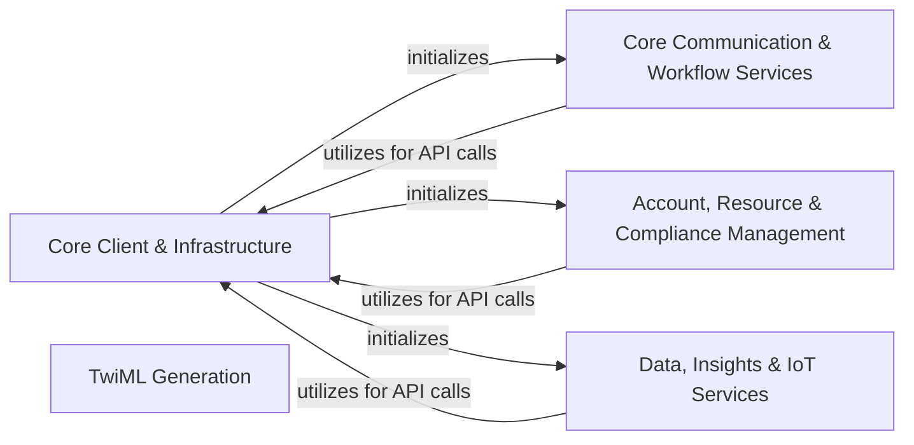

## Component Details

The `twilio-python` library provides a comprehensive SDK for interacting with Twilio's various cloud communication APIs. The main flow involves initializing a central `Twilio Client` which then provides access to a wide array of specialized API clients. These clients, categorized by their functional domains, leverage a common `API Interaction Framework` and `HTTP & Security Layer` for making authenticated requests and handling responses. Additionally, the library offers a `TwiML Generation` utility for programmatically constructing Twilio Markup Language responses, which are consumed by Twilio services.

### Core Client & Infrastructure
Provides the central entry point for all Twilio API interactions, encompassing the foundational framework for managing API versions, domains, resource interactions, and handling low-level HTTP communication, authentication, and request validation.

**Related Classes/Methods**:

- `twilio.rest.Client` (full file reference)
- <a href="https://github.com/twilio/twilio-python/blob/master/twilio/base/version.py#L11-L489" target="_blank" rel="noopener noreferrer">`twilio.base.version.Version` (11:489)</a>
- <a href="https://github.com/twilio/twilio-python/blob/master/twilio/base/domain.py#L6-L93" target="_blank" rel="noopener noreferrer">`twilio.base.domain.Domain` (6:93)</a>
- <a href="https://github.com/twilio/twilio-python/blob/master/twilio/base/client_base.py#L13-L271" target="_blank" rel="noopener noreferrer">`twilio.base.client_base.ClientBase` (13:271)</a>
- <a href="https://github.com/twilio/twilio-python/blob/master/twilio/base/exceptions.py#L10-L82" target="_blank" rel="noopener noreferrer">`twilio.base.exceptions.TwilioRestException` (10:82)</a>
- <a href="https://github.com/twilio/twilio-python/blob/master/twilio/base/page.py#L8-L173" target="_blank" rel="noopener noreferrer">`twilio.base.page.Page` (8:173)</a>
- <a href="https://github.com/twilio/twilio-python/blob/master/twilio/base/list_resource.py#L4-L6" target="_blank" rel="noopener noreferrer">`twilio.base.list_resource.ListResource` (4:6)</a>
- <a href="https://github.com/twilio/twilio-python/blob/master/twilio/base/instance_resource.py#L4-L6" target="_blank" rel="noopener noreferrer">`twilio.base.instance_resource.InstanceResource` (4:6)</a>
- <a href="https://github.com/twilio/twilio-python/blob/master/twilio/base/instance_context.py#L4-L6" target="_blank" rel="noopener noreferrer">`twilio.base.instance_context.InstanceContext` (4:6)</a>
- <a href="https://github.com/twilio/twilio-python/blob/master/twilio/base/values.py#L6-L13" target="_blank" rel="noopener noreferrer">`twilio.base.values.of` (6:13)</a>
- `twilio.base.serialize` (full file reference)
- `twilio.base.deserialize` (full file reference)
- `twilio.base.obsolete` (full file reference)
- <a href="https://github.com/twilio/twilio-python/blob/master/twilio/http/http_client.py#L15-L119" target="_blank" rel="noopener noreferrer">`twilio.http.http_client.TwilioHttpClient` (15:119)</a>
- <a href="https://github.com/twilio/twilio-python/blob/master/twilio/http/request.py#L10-L91" target="_blank" rel="noopener noreferrer">`twilio.http.request.Request` (10:91)</a>
- `twilio.http.HttpClient` (full file reference)
- `twilio.http.AsyncHttpClient` (full file reference)
- <a href="https://github.com/twilio/twilio-python/blob/master/twilio/http/async_http_client.py#L14-L135" target="_blank" rel="noopener noreferrer">`twilio.http.async_http_client.AsyncTwilioHttpClient` (14:135)</a>
- <a href="https://github.com/twilio/twilio-python/blob/master/twilio/auth_strategy/no_auth_strategy.py#L5-L13" target="_blank" rel="noopener noreferrer">`twilio.auth_strategy.no_auth_strategy.NoAuthStrategy` (5:13)</a>
- <a href="https://github.com/twilio/twilio-python/blob/master/twilio/auth_strategy/token_auth_strategy.py#L11-L55" target="_blank" rel="noopener noreferrer">`twilio.auth_strategy.token_auth_strategy.TokenAuthStrategy` (11:55)</a>
- <a href="https://github.com/twilio/twilio-python/blob/master/twilio/credential/client_credential_provider.py#L8-L28" target="_blank" rel="noopener noreferrer">`twilio.credential.client_credential_provider.ClientCredentialProvider` (8:28)</a>
- <a href="https://github.com/twilio/twilio-python/blob/master/twilio/credential/orgs_credential_provider.py#L8-L28" target="_blank" rel="noopener noreferrer">`twilio.credential.orgs_credential_provider.OrgsCredentialProvider` (8:28)</a>
- <a href="https://github.com/twilio/twilio-python/blob/master/twilio/http/client_token_manager.py#L5-L41" target="_blank" rel="noopener noreferrer">`twilio.http.client_token_manager.ClientTokenManager` (5:41)</a>
- <a href="https://github.com/twilio/twilio-python/blob/master/twilio/http/orgs_token_manager.py#L5-L41" target="_blank" rel="noopener noreferrer">`twilio.http.orgs_token_manager.OrgTokenManager` (5:41)</a>
- <a href="https://github.com/twilio/twilio-python/blob/master/twilio/http/validation_client.py#L18-L138" target="_blank" rel="noopener noreferrer">`twilio.http.validation_client.ValidationClient` (18:138)</a>
- `twilio.jwt.Jwt` (full file reference)
- <a href="https://github.com/twilio/twilio-python/blob/master/twilio/jwt/taskrouter/capabilities.py#L4-L68" target="_blank" rel="noopener noreferrer">`twilio.jwt.taskrouter.capabilities.WorkerCapabilityToken` (4:68)</a>
- <a href="https://github.com/twilio/twilio-python/blob/master/twilio/jwt/taskrouter/capabilities.py#L71-L93" target="_blank" rel="noopener noreferrer">`twilio.jwt.taskrouter.capabilities.TaskQueueCapabilityToken` (71:93)</a>
- <a href="https://github.com/twilio/twilio-python/blob/master/twilio/jwt/taskrouter/capabilities.py#L96-L116" target="_blank" rel="noopener noreferrer">`twilio.jwt.taskrouter.capabilities.WorkspaceCapabilityToken` (96:116)</a>
- `twilio.jwt.taskrouter.TaskRouterCapabilityToken` (full file reference)
- `twilio.jwt.access_token.AccessTokenGrant` (full file reference)
- `twilio.jwt.access_token.AccessToken` (full file reference)
- `twilio.jwt.validation.ClientValidationJwt` (full file reference)
- `twilio.jwt.client.ClientCapabilityToken` (full file reference)
- `twilio.jwt.client.ScopeURI` (full file reference)
- <a href="https://github.com/twilio/twilio-python/blob/master/twilio/request_validator.py#L61-L137" target="_blank" rel="noopener noreferrer">`twilio.request_validator.RequestValidator` (61:137)</a>

### TwiML Generation
Provides classes and methods for programmatically constructing Twilio Markup Language (TwiML) responses, which define the behavior of Twilio voice calls, SMS messages, and faxes.

**Related Classes/Methods**:

- <a href="https://github.com/twilio/twilio-python/blob/master/twilio/twiml/fax_response.py#L14-L51" target="_blank" rel="noopener noreferrer">`twilio.twiml.fax_response.FaxResponse` (14:51)</a>
- <a href="https://github.com/twilio/twilio-python/blob/master/twilio/twiml/voice_response.py#L14-L564" target="_blank" rel="noopener noreferrer">`twilio.twiml.voice_response.VoiceResponse` (14:564)</a>
- <a href="https://github.com/twilio/twilio-python/blob/master/twilio/twiml/messaging_response.py#L14-L66" target="_blank" rel="noopener noreferrer">`twilio.twiml.messaging_response.MessagingResponse` (14:66)</a>
- `twilio.twiml.TwiML` (full file reference)
- `twilio.twiml.GenericNode` (full file reference)
- `twilio.twiml.TwiMLException` (full file reference)
- `twilio.twiml.lower_camel` (full file reference)

### Core Communication & Workflow Services
Encompasses clients for managing fundamental Twilio communication services (messaging, voice, video, chat, conversations, notifications) and enabling complex communication workflows, including task routing, serverless functions, visual workflow building (Studio), AI assistants, proxy services, Flex contact center functionalities, and Frontline user management.

**Related Classes/Methods**:

- <a href="https://github.com/twilio/twilio-python/blob/master/twilio/rest/api/ApiBase.py#L19-L44" target="_blank" rel="noopener noreferrer">`twilio.rest.api.ApiBase` (19:44)</a>
- <a href="https://github.com/twilio/twilio-python/blob/master/twilio/rest/messaging/MessagingBase.py#L20-L55" target="_blank" rel="noopener noreferrer">`twilio.rest.messaging.MessagingBase` (20:55)</a>
- <a href="https://github.com/twilio/twilio-python/blob/master/twilio/rest/voice/VoiceBase.py#L19-L44" target="_blank" rel="noopener noreferrer">`twilio.rest.voice.VoiceBase` (19:44)</a>
- <a href="https://github.com/twilio/twilio-python/blob/master/twilio/rest/video/VideoBase.py#L19-L44" target="_blank" rel="noopener noreferrer">`twilio.rest.video.VideoBase` (19:44)</a>
- <a href="https://github.com/twilio/twilio-python/blob/master/twilio/rest/chat/ChatBase.py#L21-L66" target="_blank" rel="noopener noreferrer">`twilio.rest.chat.ChatBase` (21:66)</a>
- <a href="https://github.com/twilio/twilio-python/blob/master/twilio/rest/conversations/ConversationsBase.py#L19-L44" target="_blank" rel="noopener noreferrer">`twilio.rest.conversations.ConversationsBase` (19:44)</a>
- <a href="https://github.com/twilio/twilio-python/blob/master/twilio/rest/notify/NotifyBase.py#L19-L44" target="_blank" rel="noopener noreferrer">`twilio.rest.notify.NotifyBase` (19:44)</a>
- <a href="https://github.com/twilio/twilio-python/blob/master/twilio/rest/taskrouter/TaskrouterBase.py#L19-L44" target="_blank" rel="noopener noreferrer">`twilio.rest.taskrouter.TaskrouterBase` (19:44)</a>
- <a href="https://github.com/twilio/twilio-python/blob/master/twilio/rest/serverless/ServerlessBase.py#L19-L44" target="_blank" rel="noopener noreferrer">`twilio.rest.serverless.ServerlessBase` (19:44)</a>
- <a href="https://github.com/twilio/twilio-python/blob/master/twilio/rest/studio/StudioBase.py#L20-L55" target="_blank" rel="noopener noreferrer">`twilio.rest.studio.StudioBase` (20:55)</a>
- <a href="https://github.com/twilio/twilio-python/blob/master/twilio/rest/assistants/AssistantsBase.py#L19-L44" target="_blank" rel="noopener noreferrer">`twilio.rest.assistants.AssistantsBase` (19:44)</a>
- <a href="https://github.com/twilio/twilio-python/blob/master/twilio/rest/proxy/ProxyBase.py#L19-L44" target="_blank" rel="noopener noreferrer">`twilio.rest.proxy.ProxyBase` (19:44)</a>
- <a href="https://github.com/twilio/twilio-python/blob/master/twilio/rest/flex_api/FlexApiBase.py#L20-L55" target="_blank" rel="noopener noreferrer">`twilio.rest.flex_api.FlexApiBase` (20:55)</a>
- <a href="https://github.com/twilio/twilio-python/blob/master/twilio/rest/frontline_api/FrontlineApiBase.py#L19-L44" target="_blank" rel="noopener noreferrer">`twilio.rest.frontline_api.FrontlineApiBase` (19:44)</a>

### Account, Resource & Compliance Management
Provides functionalities for managing Twilio account-related resources, including authentication tokens, phone numbers, pricing information, marketplace add-ons, identity and access management, OAuth, preview features, user verification workflows, and regulatory compliance resources.

**Related Classes/Methods**:

- <a href="https://github.com/twilio/twilio-python/blob/master/twilio/rest/accounts/AccountsBase.py#L19-L44" target="_blank" rel="noopener noreferrer">`twilio.rest.accounts.AccountsBase` (19:44)</a>
- <a href="https://github.com/twilio/twilio-python/blob/master/twilio/rest/numbers/NumbersBase.py#L20-L55" target="_blank" rel="noopener noreferrer">`twilio.rest.numbers.NumbersBase` (20:55)</a>
- <a href="https://github.com/twilio/twilio-python/blob/master/twilio/rest/pricing/PricingBase.py#L20-L55" target="_blank" rel="noopener noreferrer">`twilio.rest.pricing.PricingBase` (20:55)</a>
- <a href="https://github.com/twilio/twilio-python/blob/master/twilio/rest/marketplace/MarketplaceBase.py#L19-L44" target="_blank" rel="noopener noreferrer">`twilio.rest.marketplace.MarketplaceBase` (19:44)</a>
- <a href="https://github.com/twilio/twilio-python/blob/master/twilio/rest/iam/IamBase.py#L19-L44" target="_blank" rel="noopener noreferrer">`twilio.rest.iam.IamBase` (19:44)</a>
- <a href="https://github.com/twilio/twilio-python/blob/master/twilio/rest/oauth/OauthBase.py#L19-L44" target="_blank" rel="noopener noreferrer">`twilio.rest.oauth.OauthBase` (19:44)</a>
- <a href="https://github.com/twilio/twilio-python/blob/master/twilio/rest/preview/PreviewBase.py#L21-L66" target="_blank" rel="noopener noreferrer">`twilio.rest.preview.PreviewBase` (21:66)</a>
- <a href="https://github.com/twilio/twilio-python/blob/master/twilio/rest/verify/VerifyBase.py#L19-L44" target="_blank" rel="noopener noreferrer">`twilio.rest.verify.VerifyBase` (19:44)</a>
- <a href="https://github.com/twilio/twilio-python/blob/master/twilio/rest/trusthub/TrusthubBase.py#L19-L44" target="_blank" rel="noopener noreferrer">`twilio.rest.trusthub.TrusthubBase` (19:44)</a>

### Data, Insights & IoT Services
Offers access to various data points and insights, including call summaries, conference details, event streams, monitoring alerts, intelligence services, and interfaces for managing Twilio's IoT and specialized connectivity services like Super SIMs, wireless devices, and Microvisor for embedded systems.

**Related Classes/Methods**:

- <a href="https://github.com/twilio/twilio-python/blob/master/twilio/rest/insights/InsightsBase.py#L19-L44" target="_blank" rel="noopener noreferrer">`twilio.rest.insights.InsightsBase` (19:44)</a>
- <a href="https://github.com/twilio/twilio-python/blob/master/twilio/rest/events/EventsBase.py#L19-L44" target="_blank" rel="noopener noreferrer">`twilio.rest.events.EventsBase` (19:44)</a>
- <a href="https://github.com/twilio/twilio-python/blob/master/twilio/rest/intelligence/IntelligenceBase.py#L19-L44" target="_blank" rel="noopener noreferrer">`twilio.rest.intelligence.IntelligenceBase` (19:44)</a>
- <a href="https://github.com/twilio/twilio-python/blob/master/twilio/rest/monitor/MonitorBase.py#L19-L44" target="_blank" rel="noopener noreferrer">`twilio.rest.monitor.MonitorBase` (19:44)</a>
- <a href="https://github.com/twilio/twilio-python/blob/master/twilio/rest/bulkexports/BulkexportsBase.py#L19-L44" target="_blank" rel="noopener noreferrer">`twilio.rest.bulkexports.BulkexportsBase` (19:44)</a>
- <a href="https://github.com/twilio/twilio-python/blob/master/twilio/rest/wireless/WirelessBase.py#L19-L44" target="_blank" rel="noopener noreferrer">`twilio.rest.wireless.WirelessBase` (19:44)</a>
- <a href="https://github.com/twilio/twilio-python/blob/master/twilio/rest/supersim/SupersimBase.py#L19-L44" target="_blank" rel="noopener noreferrer">`twilio.rest.supersim.SupersimBase` (19:44)</a>
- <a href="https://github.com/twilio/twilio-python/blob/master/twilio/rest/microvisor/MicrovisorBase.py#L19-L44" target="_blank" rel="noopener noreferrer">`twilio.rest.microvisor.MicrovisorBase` (19:44)</a>

### [FAQ](https://github.com/CodeBoarding/GeneratedOnBoardings/tree/main?tab=readme-ov-file#faq)